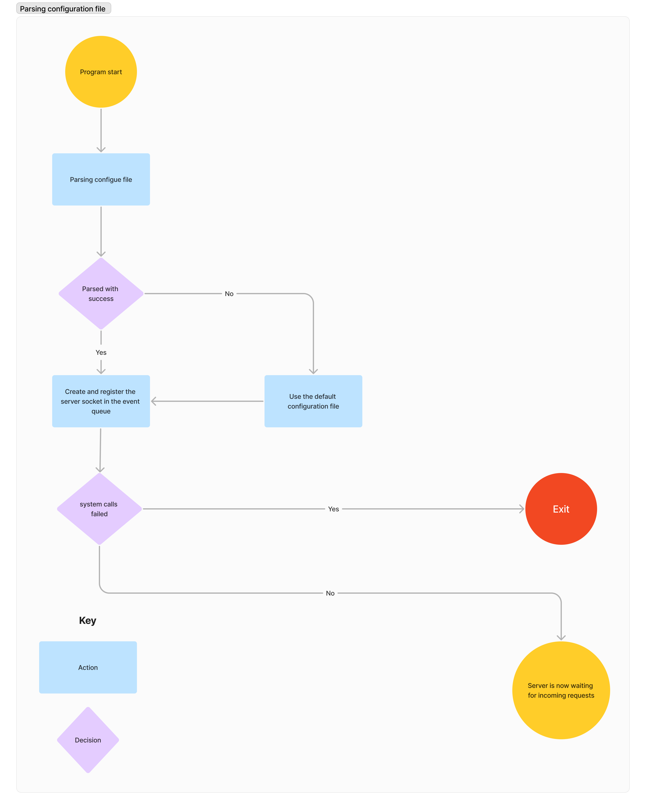
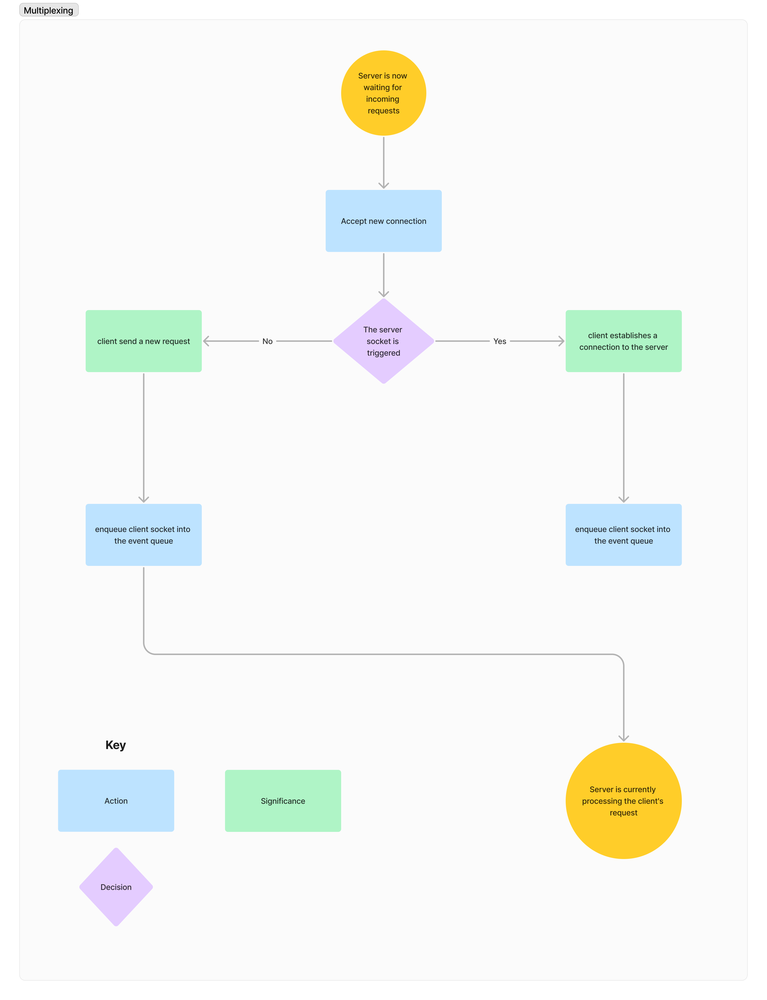
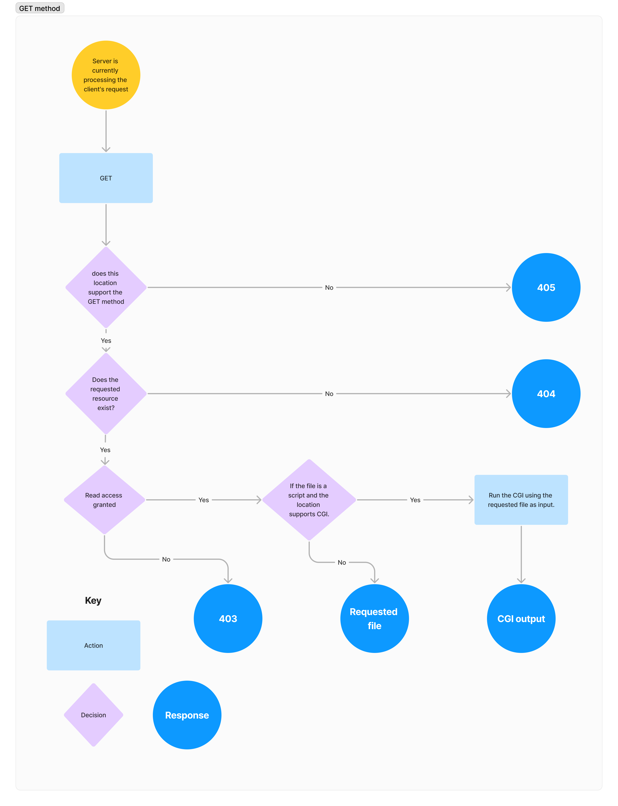
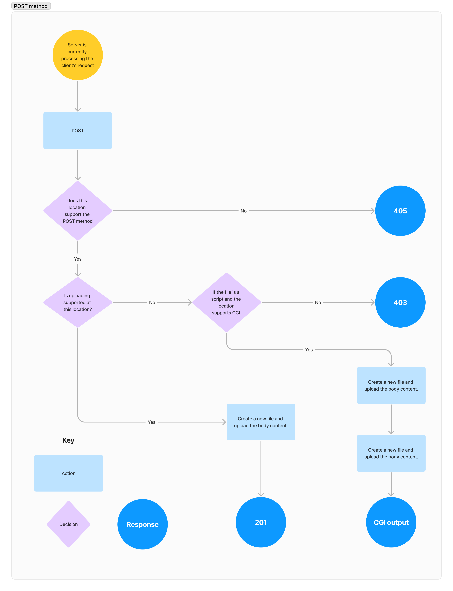
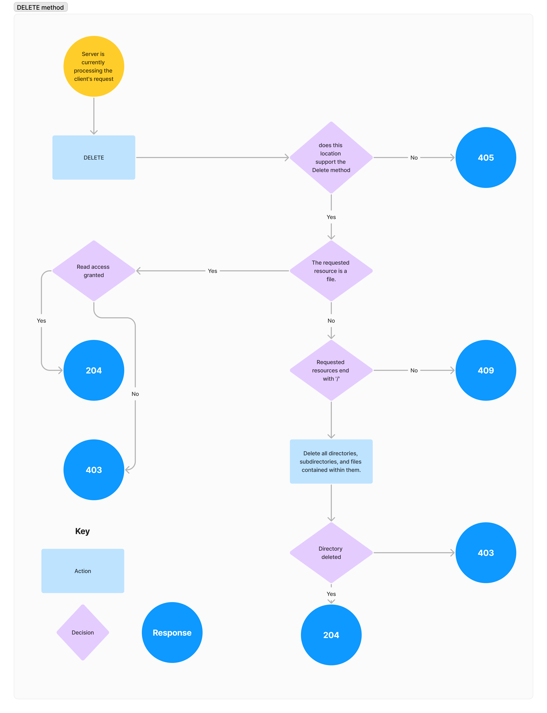

## Table Of Contents

* [About the Project](#about-the-project)
* [Built With](#built-with)
* [Usage](#usage)
* [Roadmap](#roadmap)
* [Authors](#authors)
* [Conclusion](#conclusion)

## About The Project

This project is a web server designed to handle HTTP requests and send HTTP responses. It can also execute scripts, such as PHP and Perl, by utilizing the appropriate CGI. Additionally, it features session management using cookies.

Insights this project can teach you:

* The fundamentals of configuration files and their functioning mechanism.
* Exploring the HTTP protocol in detail.
* The process of establishing a TCP connection between the client and the server.
* How can a web server manage multiple clients using non-blocking I/O and multiplexing techniques?
* HTTP is a stateless protocol, so we need to use cookies for session management in our project.


## Built With

This project is programmed using the C++ language and utilizes network system calls in C.

## Usage

When the code compiled you have run the programme with one argument wich is the name of the configue file and make sure to respect the configue roles [Configue File](#configue-file)

## Roadmap







## Configue File

here is a valid configuration file example:

```
server {
	listen	localhost:8080
	max_body_size 20000
	root      ./
	index     index.html
	  
	location / {
		
		upload		/upload
		cgi	.php	./cgi-scripts/php-cgi
		cgi	.pl		/usr/bin/perl
		cgi .py		/usr/bin/python
		
		allowed_methods POST DELETE GET
		auto_indexing on
		root  ./
		index	index.html

		}
	};
```

Below is a straightforward breakdown of each term:

**listen:** 
It is necessary to provide a valid IPv4 address and a valid port number, separated by a colon. The objective is to configure your server to listen on this specified IP address and port.


**max_body_size:** accepts a single number that represents the maximum body size allowed for a post request, enabling you to specify a particular size limit for uploads to your server.

**root:** refers to a specified path, which is the location from which your web server will share files. You can have a global root declaration that the web server will default to for sharing files if no specific path is defined within the location settings.

**index:** in a GET request, you may request a directory, and the web server will serve you this index file only if index set in this location and auto-indexing is set to false or not configured. You can declare the index setting globally or locally.

**auto-indexing:** In a GET request, this displays all files and directories when you request a directory.

**allowed Methods:** In this location, you can specify all the methods that are permitted. In our case, we have implemented three methods: GET, POST, and DELETE.

**upload:** upload is a specific location where the web server stores files received through POST requests.

**cgi:** It is necessary to provide the extension rather than the path of the executable. In essence, if your requested resources end with such an extension, the webserver simply passes this file as an input to the corresponding executable.

The behavior of your web server is determined by its configuration file, so feel free to edit it, but please respect the parameters.

## Authors

* **Hamza Harik** - *1337 Student* - [Hamza Harik](https://github.com/hharik)
* **Ayoub Jemraoui** - *1337 Student* - [Ayoub Jemraoui](https://github.com/ajemraou)

## Conclusion

This project was designed in accordance with the [RFC 2616](https://datatracker.ietf.org/doc/html/rfc2616) standards. While we may not adhere strictly to every specification, we have made maximum effort to ensure optimal functionality. At times, we draw inspiration from web servers like Nginx or Lighttpd, and at other times, we implement our unique behavior. The primary goal of this project is to facilitate learning about the inner workings of web servers.